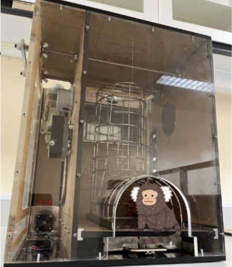

## Web Application Platform for Behavioral Experiments In Non-human Primates

This document is created for people who want to collaborate on the project, whether as researchers implementing tasks or engineers who want to further develop the web application and/or hardware integration.

  

#####  **This project was conducted under the supervision of Dr. rer. nat. Lalitta Suriya-Arunroj at the Behavioral and Cognitive Neuroscience Lab, Chulalongkorn Hospital.** 
 
## Getting started

* **Tour** section provides a detailed explanation of the project.
* **Tutorial** section provides a step-by-step guide to implementing the web application's functions.

If your role is a **researcher**, contributing to high-level functions like adding new tasks, it is suggested to first go through **the Web application concept review** to get familiar with thing under the hood of the system.
If you still struggle with the concept, go through the **Django concept review** for an abstract overview of the core framework that powers the system. There is no need for a deep understanding of the framework, as the tutorial section will guide you with clear examples.

If your role is an **engineer**, feel free to navigate through the **Integrated System Implementation** section for an explanation about the apparatus of this project.